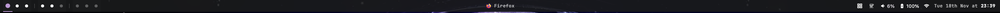

# jaybar

A Flutter-powered status bar for macOS that integrates with yabai window manager.



## Features

- **Yabai Integration**: Real-time workspace/space switching with visual feedback
- **System Monitoring**: Battery, volume, network status, and time/date display
- **Layout Mode Indicator**: Displays current yabai layout (bsp/stack/float)
- **Current App Display**: Shows focused application with icon
- **Caffeinate Toggle**: Quick access to prevent system sleep

## Installation

### Homebrew (recommended)

```bash
brew tap SubiqT/jaybar
brew install jaybar
```

### Build from source

```bash
# Clone and build
git clone https://github.com/SubiqT/jaybar.git
cd jaybar
flutter pub get
flutter build macos --release

# Install to Applications
cp -r build/macos/Build/Products/Release/jaybar.app /Applications/

# Add to PATH for CLI access
echo 'export PATH="/Applications/jaybar.app/Contents/MacOS:$PATH"' >> ~/.zshrc
source ~/.zshrc

# Enable and start the service
jaybar --enable-service
jaybar --start-service
```

## License

MIT
